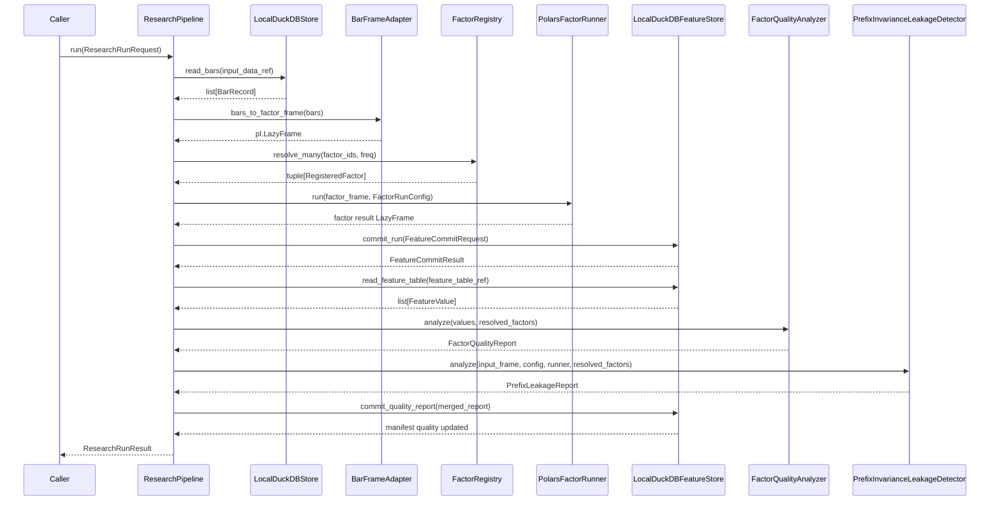

# Research Pipeline Development Spec

> Branch: `feature/factor-quality-metrics`
> Scope: curated bars -> factor compute -> FeatureStore -> quality metrics -> research run result.
> Status: implementation-ready spec for the next development slice.

## 1. Purpose

`ResearchPipeline` is the orchestration boundary for one reproducible batch
research run.

It does not introduce a new compute engine, storage engine, or quality rule. It
coordinates the modules that already exist:

```text
LocalDuckDBStore
  -> bar frame adapter
  -> FactorRegistry
  -> PolarsFactorRunner
  -> LocalDuckDBFeatureStore
  -> FactorQualityAnalyzer
  -> PrefixInvarianceLeakageDetector
  -> factor_run_manifest
```

The goal is to turn scattered script-level calls into one stable service:

```python
result = ResearchPipeline(...).run(request)
```

The caller should express what to run through `ResearchRunRequest` and consume
what happened through `ResearchRunResult`.

## 2. Current State

Already implemented:

| Layer | Implemented entry point |
|---|---|
| Data ingestion | `quant_research.data.ingestion.DataIngestionService` |
| Bar storage | `quant_research.data.duckdb_store.LocalDuckDBStore` |
| Factor registry | `quant_research.factors.registry.FactorRegistry` |
| Factor execution | `quant_research.factors.polars.PolarsFactorRunner` |
| Feature persistence | `quant_research.features.duckdb_store.LocalDuckDBFeatureStore` |
| Feature transform | `quant_research.features.transform.wide_to_feature_values` |
| Static quality | `quant_research.features.quality.FactorQualityAnalyzer` |
| Dynamic leakage probe | `quant_research.features.leakage.PrefixInvarianceLeakageDetector` |

Missing orchestration:

```text
read curated bars
  -> build factor input frame
  -> compute selected factors
  -> commit feature_table and feature_snapshot
  -> read committed FeatureValue rows
  -> run static factor quality
  -> run prefix-invariance leakage probe
  -> merge metrics
  -> commit quality report
  -> return stable refs and status
```

## 3. Non-Goals

This slice must not implement:

| Non-goal | Reason |
|---|---|
| Strategy decisions | Strategy belongs above feature consumption. |
| Backtest engine | Backtest should consume `FeatureSnapshot`, not own factor computation. |
| Order, risk, account, gateway modules | Research pipeline must have no trading side effects. |
| New factor formulas | Factor authoring stays in the factor layer. |
| New DuckDB schema for bars/features | Use current data and feature stores. |
| Label store | Labels are a later slice after feature pipeline is stable. |
| CLI | CLI can call this service later; first stabilize service contracts. |

## 4. Data Flow



## 5. Module Layout

Create:

```text
src/quant_research/pipeline/__init__.py
src/quant_research/pipeline/bar_frame.py
src/quant_research/pipeline/contracts.py
src/quant_research/pipeline/research.py
tests/pipeline/test_bar_frame.py
tests/pipeline/test_research_pipeline.py
```

Do not move existing modules. The pipeline imports them as dependencies.

## 6. Contracts

### 6.1 `ResearchRunStatus`

```python
class ResearchRunStatus(StrEnum):
    COMMITTED = "COMMITTED"
    QUALITY_FAILED = "QUALITY_FAILED"
    FAILED = "FAILED"
```

Semantics:

| Status | Meaning |
|---|---|
| `COMMITTED` | Feature rows and quality report were committed; quality is `PASSED` or `WARNING`. |
| `QUALITY_FAILED` | Feature rows were committed, but quality report is `FAILED`. |
| `FAILED` | Pipeline failed before a usable feature result was committed. |

`QUALITY_FAILED` is not a storage failure. It is an intentional audit state:
rows exist for debugging, but downstream consumers should block by default.

### 6.2 `ResearchRunRequest`

```python
@dataclass(frozen=True)
class ResearchRunRequest:
    factor_run_id: str
    feature_set_id: str
    input_data_ref: str
    factor_ids: tuple[str, ...]
    dataset_id: str
    freq: Frequency
    symbols: tuple[str, ...] | None = None
    as_of_start: datetime | None = None
    as_of_end: datetime | None = None
    strict_quality: bool = True
    allow_failed_overwrite: bool = False
    prefix_probe_config: PrefixProbeConfig | None = None
    engine: str = "polars"
    execution_mode: str = "lazy"
    seed: int | None = None
```

Validation rules:

| Field | Rule |
|---|---|
| `factor_run_id` | Required and non-empty. |
| `feature_set_id` | Required and non-empty. |
| `input_data_ref` | Must parse as `duckdb://...`. |
| `factor_ids` | Must not be empty. |
| `dataset_id` | Required and non-empty. |
| `symbols` | Optional consumer filter; empty tuple is invalid. |
| `as_of_start/as_of_end` | If both present, `as_of_start <= as_of_end`. |
| `prefix_probe_config` | `None` disables dynamic prefix leakage probing. |

`ResearchRunRequest` is converted into `FactorRunConfig` before calling the
factor runner.

### 6.3 `ResearchRunResult`

```python
@dataclass(frozen=True)
class ResearchRunResult:
    factor_run_id: str
    status: ResearchRunStatus
    feature_table_ref: DataRef | None
    snapshot_ref: DataRef | None
    manifest_ref: DataRef | None
    quality_status: QualityStatus
    quality_summary: dict[str, Any]
    row_count_input: int
    row_count_feature: int
    row_count_snapshot: int
    metric_count: int
    error_step: str | None = None
    error_code: str | None = None
    error_message: str | None = None
```

Result rules:

| Field | Rule |
|---|---|
| `feature_table_ref` | Present only after `FeatureStore.commit_run` returns a ref. |
| `snapshot_ref` | Present for successful feature commits. |
| `manifest_ref` | Present after FeatureStore has written a manifest. |
| `quality_status` | Mirrors the final committed `FactorQualityReport.status`. |
| `metric_count` | Count of static quality metrics plus prefix probe metrics. |
| `error_step` | Name of failing orchestration step, such as `read_bars`, `compute_factors`, or `commit_features`. |

`manifest_ref` may be `None` only when the pipeline fails before FeatureStore can
write any manifest. A later enhancement can add `commit_failed_run(...)` to
guarantee failure manifests for pre-commit errors.

## 7. Bar Frame Adapter

Create a small adapter, not a new data store:

```python
def bars_to_factor_frame(bars: Iterable[BarRecord]) -> pl.LazyFrame:
    ...
```

Required output columns:

```text
dataset_id
symbol
exchange
asset_class
freq
trading_date
as_of
bar_start_time
bar_end_time
open
high
low
close
volume
turnover
adjustment
source_run_id
```

Rules:

| Rule | Meaning |
|---|---|
| `as_of = bar_end_time` | In MVP-1, factor value timestamp is the bar end timestamp. |
| OHLCV cast to float | Numeric compute starts at the pipeline adapter boundary. |
| Preserve `bar_start_time/bar_end_time` | Keep lineage for later event-time checks. |
| Preserve `source_run_id` | Feature rows can trace back to an import run. |
| Empty input fails | Avoid committing empty feature runs. |

This adapter is deliberately separate from `LocalDuckDBStore`; storage should
return domain records, and compute adapters should prepare engine-specific
frames.

## 8. Research Pipeline Service

### 8.1 Constructor

```python
@dataclass
class ResearchPipeline:
    data_store: LocalDuckDBStore
    factor_registry: FactorRegistry
    factor_runner: PolarsFactorRunner
    feature_store: LocalDuckDBFeatureStore
    quality_analyzer: FactorQualityAnalyzer
    leakage_detector: PrefixInvarianceLeakageDetector
```

MVP-1 may use concrete classes. A later port-oriented refactor can replace these
with protocols without changing request/result contracts.

### 8.2 `run(...)`

```python
def run(self, request: ResearchRunRequest) -> ResearchRunResult:
    ...
```

Execution order:

1. Validate `ResearchRunRequest`.
2. Parse `input_data_ref`.
3. Read bars from `LocalDuckDBStore`.
4. Apply request filters that are not already encoded in `input_data_ref`:
   `symbols`, `as_of_start`, `as_of_end`.
5. Convert bars to factor input frame.
6. Resolve requested factors for `freq`.
7. Build `FactorRunConfig`.
8. Run `PolarsFactorRunner`.
9. Commit features through `LocalDuckDBFeatureStore.commit_run(...)`.
10. Read committed `FeatureValue` rows from `feature_table_ref`.
11. Run `FactorQualityAnalyzer`.
12. If `prefix_probe_config is not None`, run `PrefixInvarianceLeakageDetector`.
13. Merge static and prefix metrics into one `FactorQualityReport`.
14. Persist quality report with `commit_quality_report(...)`.
15. Return `ResearchRunResult`.

### 8.3 Request to `FactorRunConfig`

```python
FactorRunConfig(
    factor_run_id=request.factor_run_id,
    feature_set_id=request.feature_set_id,
    input_data_ref=request.input_data_ref,
    factor_ids=request.factor_ids,
    freq=request.freq,
    dataset_id=request.dataset_id,
    as_of_start=request.as_of_start,
    as_of_end=request.as_of_end,
    symbols=request.symbols,
    engine=request.engine,
    execution_mode=request.execution_mode,
    strict_quality=request.strict_quality,
    seed=request.seed,
)
```

## 9. Quality Metric Merge

The pipeline needs a small merge helper:

```python
def merge_quality_reports(
    base: FactorQualityReport,
    extra_metrics: tuple[FactorQualityMetric, ...],
) -> FactorQualityReport:
    ...
```

Status rule:

```text
any ERROR   -> FAILED
any WARNING -> WARNING
otherwise  -> PASSED
```

The prefix detector already emits `FactorQualityMetric` rows through:

```python
prefix_report_to_quality_metrics(report)
```

The merged report is the only report persisted:

```text
static metrics + prefix probe metrics -> commit_quality_report(merged_report)
```

This keeps `factor_quality_metric` as the single quality table.

## 10. Failure Semantics

| Step | Failure result |
|---|---|
| request validation | `FAILED`, `error_step="validate_request"`, no refs. |
| `DataRef` parse | `FAILED`, `error_step="parse_input_ref"`, no refs. |
| bar read | `FAILED`, `error_step="read_bars"`, no feature refs. |
| empty bars after filters | `FAILED`, `error_step="build_factor_frame"`, no feature refs. |
| factor resolution | `FAILED`, `error_step="resolve_factors"`, no feature refs. |
| factor compute | `FAILED`, `error_step="compute_factors"`, no feature refs unless FeatureStore records failure later. |
| feature commit validation | Use `FeatureCommitResult(status=FAILED)` and return its refs if present. |
| static quality failure | `QUALITY_FAILED`, feature refs present, quality persisted. |
| prefix leakage violation | `QUALITY_FAILED`, feature refs present, quality persisted. |
| prefix probe warning only | `COMMITTED`, `quality_status=WARNING`. |

Important distinction:

```text
FAILED         = pipeline could not produce a usable feature asset.
QUALITY_FAILED = asset exists but should be blocked by quality gate.
```

## 11. Downstream Consumption Rule

The pipeline must not decide how a strategy trades. It only returns a quality
state.

Default consumer policy:

```text
quality_status == PASSED  -> allowed
quality_status == WARNING -> allowed only if caller explicitly accepts warnings
quality_status == FAILED  -> blocked
```

This policy should later live in a small `features.gates` helper, not inside
`FeatureStore` and not inside strategy code.

## 12. Testing Plan

### 12.1 Bar frame adapter tests

| Test | Expected |
|---|---|
| daily bars convert to factor frame | key columns preserved, OHLCV cast to float. |
| minute bars convert to factor frame | `as_of` keeps minute `bar_end_time`. |
| empty bars fail | pipeline cannot commit empty factor input. |

### 12.2 Pipeline happy path

Fixture:

```text
bars_daily.csv
factor: ret_1
prefix_probe_config = disabled or causal-safe
```

Expected:

```text
ResearchRunResult.status = COMMITTED
quality_status = PASSED
feature_table_ref is not None
snapshot_ref is not None
manifest_ref is not None
row_count_feature > 0
row_count_snapshot > 0
```

### 12.3 Static quality failure path

Factor spec:

```python
quality_rules={"max_null_ratio": 0.0}
```

Expected:

```text
ResearchRunResult.status = QUALITY_FAILED
quality_status = FAILED
factor_quality_metric contains null_ratio ERROR
snapshot_ref exists for audit
```

### 12.4 Prefix leakage failure path

Factor:

```python
pl.col("close").shift(-1).over("symbol") / pl.col("close") - 1.0
```

Expected:

```text
ResearchRunResult.status = QUALITY_FAILED
quality_status = FAILED
factor_quality_metric contains prefix_invariance_violation_count ERROR
```

### 12.5 Request validation tests

| Invalid request | Expected error |
|---|---|
| empty `factor_run_id` | `validate_request` failure. |
| empty `factor_ids` | `validate_request` failure. |
| non-DuckDB `input_data_ref` | `parse_input_ref` failure. |
| `as_of_start > as_of_end` | `validate_request` failure. |

## 13. Implementation Order

1. Add `pipeline/contracts.py` with request/result/status.
2. Add `pipeline/bar_frame.py` and tests.
3. Add `merge_quality_reports(...)` helper.
4. Add `pipeline/research.py` service with one happy-path test.
5. Add quality failure test.
6. Add prefix leakage failure test.
7. Update README implemented entry points.
8. Run:

```bash
.venv/bin/python -m pytest -v
.venv/bin/ruff check src tests
git diff --check
```

## 14. Open Decisions

| Decision | MVP-1 choice |
|---|---|
| Should constructor use protocols now? | No. Use concrete dependencies first; add protocols after behavior stabilizes. |
| Should pipeline own ingestion? | No. It starts from `curated_market_bar` `DataRef`. |
| Should CLI be in this slice? | No. CLI should call the service after it is tested. |
| Should failed pre-commit runs always write manifest? | Not in first implementation unless FeatureStore gains `commit_failed_run(...)`. |
| Should labels be supported here? | No. Keep forward labels separate from live features in a later label-store slice. |
